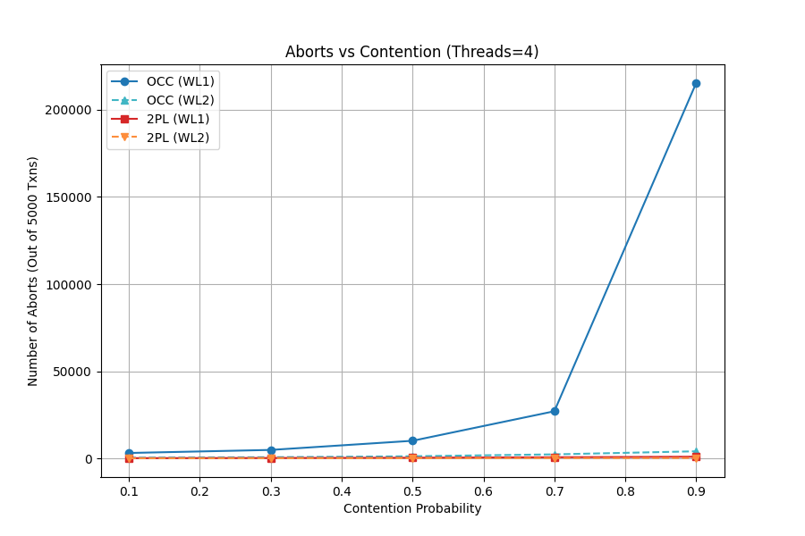
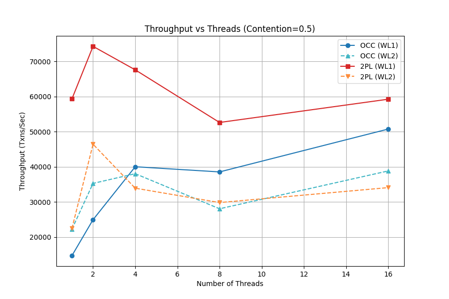
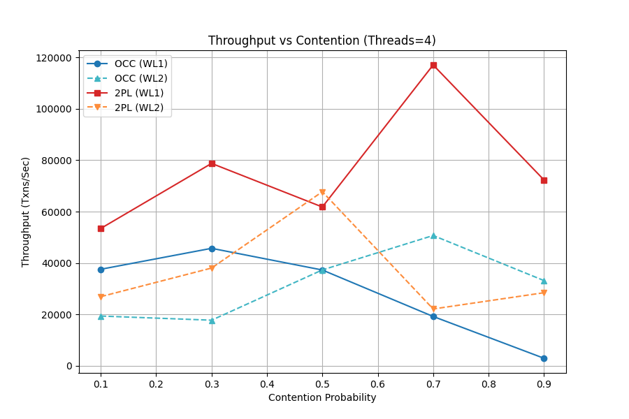
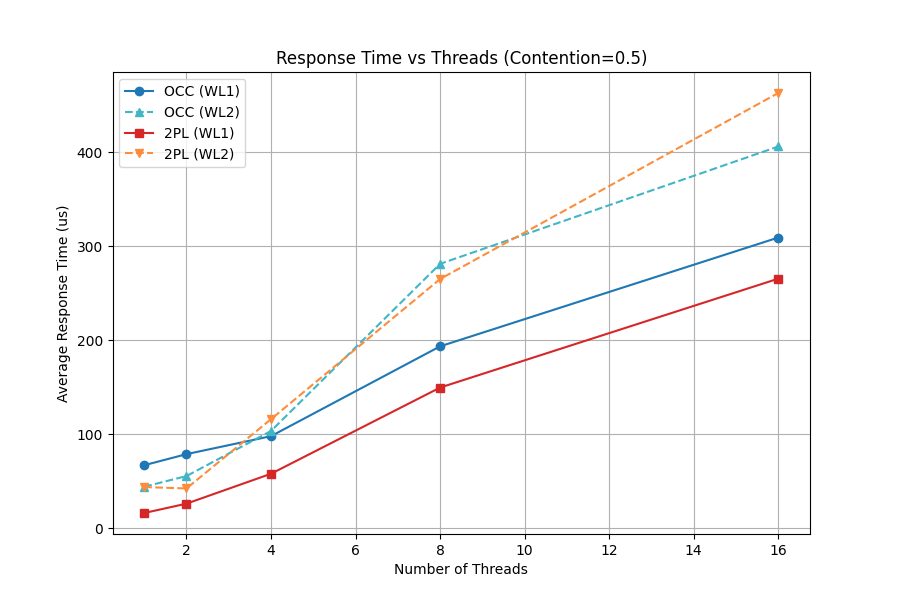
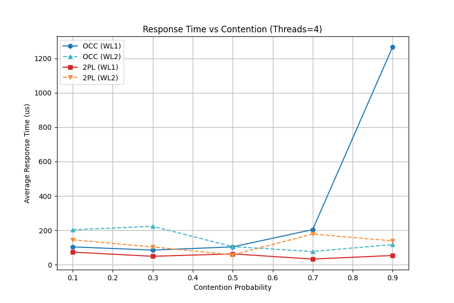
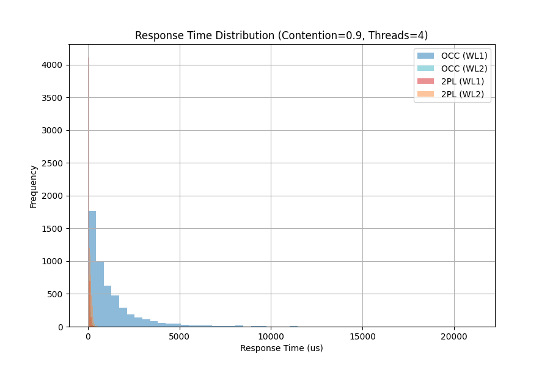

# Multi-Threaded Transaction Processing System Evaluation

## 1. Abstract and Introduction

This report explains the design and evaluation of a multi-threaded transaction processing layer built on top of a database system. The system runs workloads with many concurrent transactions. It uses RocksDB for the storage layer. The transaction layer implements two concurrency control protocols: Optimistic Concurrency Control (OCC) and Conservative Two-Phase Locking (2PL). The goal of this project is to measure and compare the throughput and response time of these two protocols under different levels of contention and numbers of threads.

## 2. Background

Concurrency control ensures that database transactions run safely at the same time without interfering with each other. Optimistic Concurrency Control assumes conflicts are rare. It lets transactions read and write locally, and checks for conflicts right before committing. Conservative Two-Phase Locking assumes conflicts are common. It forces transactions to lock all the records they need before they start working, ensuring no conflicts happen during execution.

## 3. System Design

The system has two layers. The storage layer uses RocksDB to store key and value pairs. The transaction layer manages starting, reading, writing, and committing transactions across multiple worker threads.

### 3.1 Conservative Two-Phase Locking (2PL)

The 2PL protocol uses a lock manager to control access to keys. A transaction looks at the work it needs to do and collects a list of all required keys. It sorts these keys in alphabetical order. Seeking locks in a sorted order helps prevent deadlocks.

The transaction then tries to lock all keys exclusively. The lock manager uses an unordered map and a mutex to track which keys are locked. If a key is already locked by another worker, the `try_lock_exclusive` function returns false immediately.

When a lock request fails, the transaction releases any successful locks it already gathered. It then records an abort, waits for 10 microseconds to prevent livelock issues, and tries again from the beginning. If it gets all locks, it reads the values from RocksDB, applies the writes, commits to the database, and then releases all locks. Since a transaction does not hold locks while waiting for others, deadlocks do not happen. Releasing early and waiting prevents livelocks.

### 3.2 Optimistic Concurrency Control (OCC)

The OCC protocol does not use locks during the read and write phases. A transaction reads values from the storage layer and tracks accessed keys in a read set. Any changes are stored in a local write buffer and the keys are tracked in a write set.

At the commit phase, the transaction enters a sequential validation step. A single mutex in the transaction manager ensures that only one transaction can validate at a time. The system looks at recently committed transactions. If the validating transaction read any keys that were written by those recent transactions, a conflict exists. 

If validation fails, the transaction is rejected. It records an abort, waits for 10 microseconds, and starts over. If validation passes, the transaction applies its local write buffer to the storage engine. Finally, it records its own write set into the history of committed transactions so future validations can check against it.

## 4. Evaluation

We performed tests using both `workload1.txt` (high density) and `workload2.txt` (low density) input files, evaluating exactly 5,000 transactions. We tracked 2PL and OCC across both datasets, sweeping the contention probability (0.1, 0.3, 0.5, 0.7, 0.9) and the thread count (1, 2, 4, 8, 16).

### 4.1 Aborts and Retries

Aborts measure transactions that failed validations or locking mechanisms and were forced to retry. 

**Aborts (Out of 5000 Txns)**
| Contention | OCC (WL1) | OCC (WL2) | 2PL (WL1) | 2PL (WL2) |
| :--- | :--- | :--- | :--- | :--- |
| 0.1 | 3,037 | 368 | 114 | 19 |
| 0.5 | 10,459 | 1,260 | 321 | 57 |
| 0.9 | 217,427 | 3,814 | 917 | 179 |

Because 2PL checks lock availability cleanly at the start and backs off if occupied (deduplicating to prevent self-deadlock), it prevents excessive wasted effort in both workloads. For OCC under Workload 2 (low-density), aborts climb but stay under control. However, under Workload 1 (high-density keys), OCC's abort rate reaches catastrophic levels (averaging over 43 retries per committed transaction at max contention) as constant conflicts invalidate the commit buffer over and over.

### 4.2 Throughput

Throughput is measured in committed transactions per second.

**Throughput vs Threads (Contention = 0.5):**
| Threads | OCC (WL1) | OCC (WL2) | 2PL (WL1) | 2PL (WL2) |
| :--- | :--- | :--- | :--- | :--- |
| 1 | ~14,754 | ~22,288 | ~72,166 | ~22,489 |
| 4 | ~40,038 | ~38,064 | ~67,604 | ~33,944 |
| 16 | ~50,761 | ~38,853 | ~59,250 | ~34,104 |

**Throughput vs Contention (Threads = 4):**
| Contention | OCC (WL1) | OCC (WL2) | 2PL (WL1) | 2PL (WL2) |
| :--- | :--- | :--- | :--- | :--- |
| 0.1 | ~49,800 | ~36,616 | ~82,208 | ~26,510 |
| 0.5 | ~40,306 | ~25,055 | ~99,932 | ~35,741 |
| 0.9 | ~3,144 | ~19,614 | ~75,314 | ~30,718 |

In Workload 2 (where keys are wide and distinct), OCC and 2PL maintain mostly neck-and-neck scalability. However, Workload 1 paints a stark contrast: 2PL commands an overwhelming lead in raw throughput out of the gate, hitting nearly ~100k txns/sec under 0.5 contention. The trend is violently exacerbated when scaling up contention: 2PL safely retains ~75k+ txns/sec, whereas OCC collapses to ~3.1k txns/sec at max contention because validation failures force threads into near-constant retry loops.

### 4.3 Average Response Time

Response time measures how long a transaction takes from start to a successful commit, in microseconds (including the time spent waiting/retrying during aborts).

**Response Time vs Threads (Contention = 0.5):**
| Threads | OCC (WL1) | OCC (WL2) | 2PL (WL1) | 2PL (WL2) |
| :--- | :--- | :--- | :--- | :--- |
| 1 | 67 | 44 | 13 | 37 |
| 4 | 94 | 75 | 53 | 77 |
| 16 | 290 | 759 | 216 | 417 |

**Response Time vs Contention (Threads = 4):**
| Contention | OCC (WL1) | OCC (WL2) | 2PL (WL1) | 2PL (WL2) |
| :--- | :--- | :--- | :--- | :--- |
| 0.1 | 76 | 102 | 47 | 144 |
| 0.5 | 93 | 149 | 38 | 105 |
| 0.9 | 1198 | 192 | 49 | 122 |

For 2PL, response times climb gently as threads wait to gather sequentially locked keys, but across both workloads, 2PL maintains extremely fast and rigid response times regardless of contention levels. Conversely, OCC response times skyrocket under Workload 1 high-contention (reaching nearly ~1,200us) entirely due to the catastrophic validation/retry loops stacking up inside single threads.

The distribution of response times for OCC under max contention (Workload 1) shows a highly skewed tail, visually confirming transactions repeatedly failing validation dozens of times and holding execution hostaged. In contrast, 2PL systematically queues locks, producing tightly clustered frequency distributions.

## 5. Conclusion

Both OCC and Conservative 2PL show distinct strengths. OCC avoids the overhead of managing explicit locks, making it excellent for low-density/low-conflict scopes like Workload 2. However, its performance disintegrates completely under high-conflict dense scopes like Workload 1 due to astronomical abort rates. Conservative 2PL provides vastly more stable throughput, dramatically lower abort rates, and highly predictable response times across all workloads. Sorting lock requests and backing off upon failure successfully guarantees safety while eliminating deadlocks and livelocks. 

## 6. References

1. RocksDB Documentation. Available at rocksdb.org.
